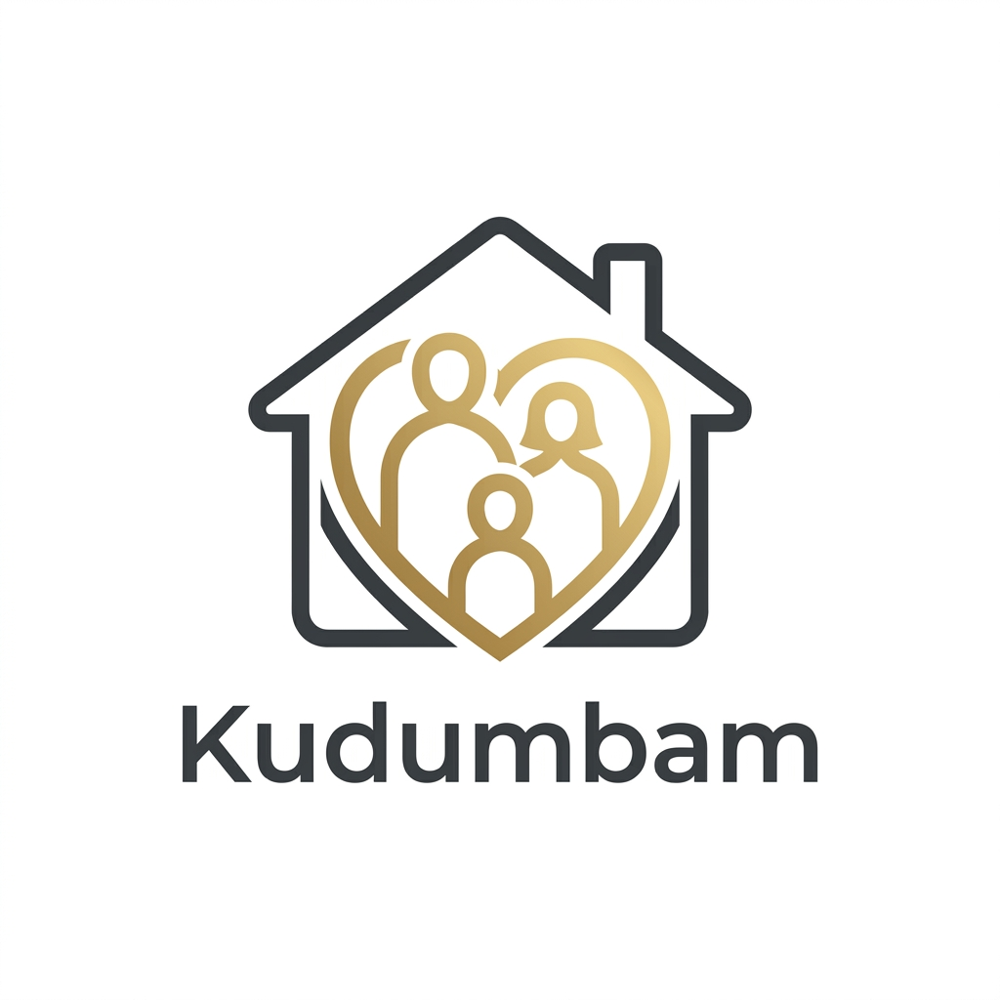

<div align="center">

  <p align="center">
    
  </p>

  # 🏠 Kudumbam.
  ### *The Private Operating System for the Modern Indian Household*
  
  <p align="center">
    
    
    
    
  </p>
</div>

---

## ✨ Overview
**Kudumbam** (Tamil: குடும்பம், meaning *Family*) is a high-fidelity, private OS designed to synchronize the logistics, finances, and relationships of a modern household. Built with a mobile-first philosophy, it brings professional-grade organization to the chaos of family life, ensuring that everything from grocery staples to health records is just a tap away.

---

## 🏗️ Core Modules

### 💰 **The Treasury (Funds & Claims)**
*   **Family Ledger**: Real-time budget tracking with a sleek dark-mode interface for the household head.
*   **Instant Claims**: One-tap reimbursement requests for grocery runs or bill payments.
*   **Admin Governance**: Secure approval workflows to manage family expenses transparently.

### 🥦 **The Provisioning (Groceries & Pantry)**
*   **Smart Grocery List**: Collaborative, real-time list building with instant sync across all family devices.
*   **Pantry Intelligence**: Specific tracking for critical staples like Tamarind, Ghee, and Spices, ensuring you never run out during a cook.

### 👥 **Sondham (Relatives Directory)**
*   **Relationship Mapping**: A dedicated space for the extended family tree, tracking birthdays and anniversaries.
*   **Contact Sync**: Integrated Web Contact Picker to import family details instantly.
*   **WhatsApp Integration**: Direct one-click connectivity to stay in touch with the circle.

### 🏥 **Family Health Hub**
*   **Medication Logs**: Track daily dosages and schedules for elders and children.
*   **Vitals Tracking**: Log blood pressure, sugar levels, and other critical health metrics.
*   **Appointment Management**: Keep the family informed about upcoming doctor visits.

### 🛠️ **Home Maintenance & Utilities**
*   **Bills & Repairs**: Manage vehicle services (oil changes, etc.), home fixes (AC cleaning), and recurring utility bills.
*   **Overdue Tracking**: Visual indicators for tasks that need immediate attention.
*   **Utility Lifecycle**: Specialized trackers for **Milk** (daily packets) and **LPG Gas** (Booking → Delivery → Usage) with automatic lifecycle estimation.

### 📋 **Household Tasks & Chores**
*   **Chore Assignment**: Assign specific tasks to family members with due dates.
*   **Recurring Tasks**: Support for daily, weekly, and monthly chores to keep the home running smoothly.
*   **Real-time Progress**: Visual feedback as chores are marked as complete.

### 📅 **Family Calendar**
*   **Centralized Events**: A unified view of holidays, family trips, and celebrations.
*   **Monthly Grouping**: Intuitively organized by months with beautiful serif typography.

---

## 🛠️ Technology Stack

| Layer | Technology |
| :--- | :--- |
| **Frontend** | React 19 + Vite (Next-gen HMR) |
| **Mobile Engine** | Capacitor 8 (High-performance Native Bridge) |
| **Backend/DB** | Firebase Firestore (Real-time NoSQL) |
| **Authentication** | Firebase Google Auth |
| **Styling** | Tailwind CSS v4 + Vanilla CSS (Luxury Minimalist Design) |
| **Animations** | Motion (Fluid, intentional transitions) |
| **Icons** | Lucide React |

---

## 📂 Project Structure

```bash
Kudumbam/
├── android/              # Native Android project (Capacitor)
├── assets/               # Branding and design assets
├── src/
│   ├── components/       # Reusable UI components (Layout, Modals, Notifications)
│   ├── context/          # Global state (Auth, Toast notifications)
│   ├── lib/              # Library initializations (Firebase, AI)
│   ├── pages/            # Feature modules (Funds, Health, Tasks, etc.)
│   ├── services/         # API and Database abstractions
│   └── index.css         # Global design tokens and tailwind configuration
├── capacitor.config.ts   # Mobile bridging configuration
├── firestore.rules       # Security rules for production
└── vite.config.ts        # Build and dev server configuration
```

---

## 🚀 Getting Started

### **1. Environment Configuration**
Create a `.env` file in the root directory:
```env
VITE_FIREBASE_API_KEY=your_key
VITE_FIREBASE_AUTH_DOMAIN=your_domain
VITE_FIREBASE_PROJECT_ID=your_id
VITE_FIREBASE_STORAGE_BUCKET=your_bucket
VITE_FIREBASE_MESSAGING_SENDER_ID=your_sender_id
VITE_FIREBASE_APP_ID=your_app_id
```

### **2. Development Workflow**
```bash
# Install dependencies
npm install

# Start the local development server
npm run dev
```

### **3. Mobile Deployment (Android)**
```bash
# Build the web bundle and sync with native
npm run mobile:build

# Open in Android Studio to generate APK/Bundle
npm run mobile:open
```

---

## 🎨 Design Philosophy
Kudumbam uses a **Premium Serif & Minimalist** aesthetic. 
*   **Typography**: *Lora* (Serif) for headers to evoke tradition, paired with *Inter* (Sans-serif) for high readability in data-heavy views.
*   **Color Palette**: Deep Charcoal (`#1A1A1A`), Warm Cream (`#FDFBF7`), and intentional accent colors (Rose for Health, Emerald for Funds).
*   **Micro-interactions**: Every button and card uses `motion` to provide tactile feedback and smooth transitions between states.

---

<div align="center">
  <p><i>"Home is where the heart (and the perfectly managed ledger) is."</i></p>
  
</div>
